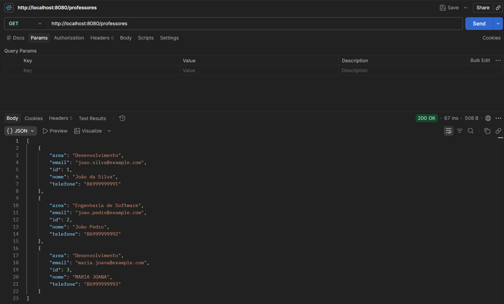
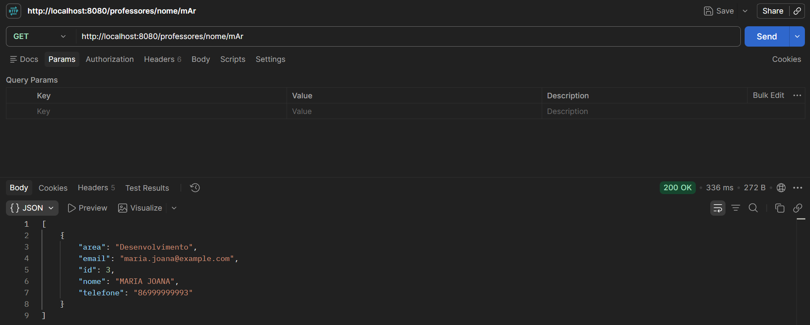
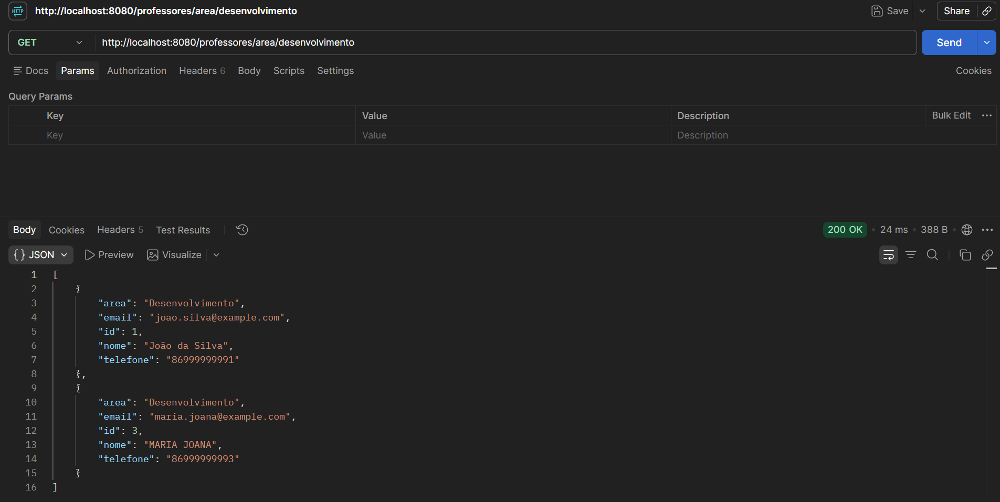
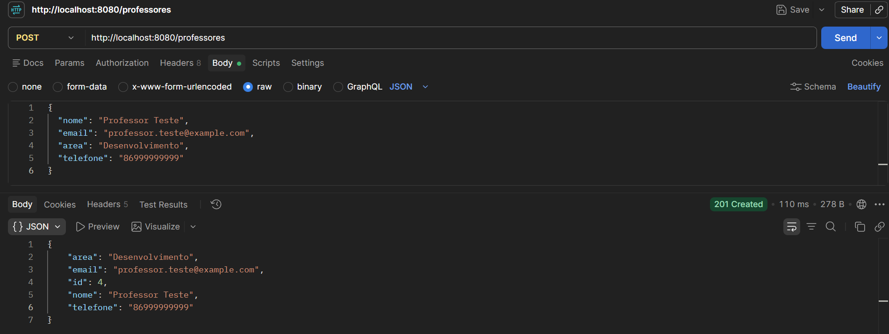
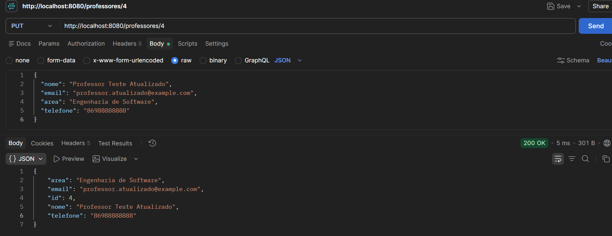
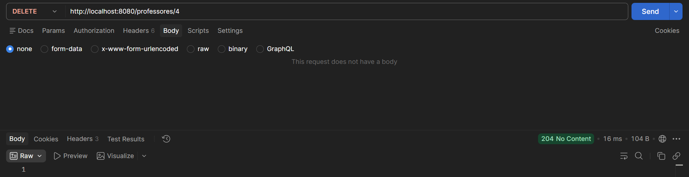

# CRUD de professores

- **Aluno:** Antonio Neves Aguiar Neto
- **Disciplina:** Desenvolvimento Back-end em Java

API REST de cadastro e gerenciamento de professores, desenvolvida a partir do projeto `gestao_fsa-main`. Permite listar, filtrar por nome e área, cadastrar, editar e excluir professores.

## Tecnologias

- Java 21
- Spring Boot 4.1.1
- Spring Web MVC
- Spring Data JPA
- SpringDoc OpenAPI 3.1.0 (Swagger UI)
- PostgreSQL
- Maven

## Como executar

1. Instale o JDK 21 e tenha um servidor PostgreSQL em execução.
2. No PostgreSQL, crie o banco de dados:

   ```sql
   CREATE DATABASE gestao_fsa;
   ```

3. Conecte-se ao banco `gestao_fsa` e execute o arquivo [`projeto/sql/professor.sql`](projeto/sql/professor.sql). Ele cria a tabela `professor` e insere os registros iniciais. Execute o script uma vez em um banco novo.
4. Configure a conexão no terminal. Exemplo para PowerShell, substituindo a senha:

   ```powershell
   $env:DB_URL = 'jdbc:postgresql://localhost:5432/gestao_fsa'
   $env:DB_USERNAME = 'postgres'
   $env:DB_PASSWORD = 'SUA_SENHA'
   ```

   Exemplo para Linux/macOS:

   ```bash
   export DB_URL='jdbc:postgresql://localhost:5432/gestao_fsa'
   export DB_USERNAME='postgres'
   export DB_PASSWORD='SUA_SENHA'
   ```

   `DB_URL` e `DB_USERNAME` têm os valores padrão acima. Informe `DB_PASSWORD` com a senha do PostgreSQL. Ajuste host, porta e banco caso sua conexão utilize valores diferentes.

   Se executar pela IDE, configure as variáveis na configuração de execução de `GestaoApplication`. No terminal, use a mesma sessão para definir as variáveis e iniciar o projeto.

   A aplicação valida a tabela criada pelo script SQL.

5. Abra um terminal na pasta `Gestao_Professores`, entre em `projeto/` e execute:

   ```powershell
   cd projeto
   .\mvnw.cmd spring-boot:run
   ```

   No Linux/macOS:

   ```bash
   cd projeto
   sh mvnw spring-boot:run
   ```

   O Maven Wrapper baixa o Maven na primeira execução caso ele ainda não esteja disponível.

6. Abra o [Swagger UI](http://localhost:8080/swagger-ui/index.html). A documentação OpenAPI está em [http://localhost:8080/v3/api-docs](http://localhost:8080/v3/api-docs).

## Estrutura

| Caminho | Conteúdo |
| --- | --- |
| `README.md` | Documentação principal do repositório |
| `imagens/` | Capturas das seis operações no Postman |
| `projeto/` | Aplicação Spring Boot, Maven Wrapper e `pom.xml` |
| `projeto/sql/` | Script de criação e população da tabela |

As classes ficam em `projeto/src/main/java/com/fsa/gestao/`:

| Camada | Arquivo | Função |
| --- | --- | --- |
| Controller | `controller/ProfessorController.java` | Endpoints REST |
| Service | `service/ProfessorService.java` | Operações de gerenciamento dos professores |
| Repository | `repository/ProfessorRepository.java` | Acesso ao banco e consultas derivadas |
| Model | `model/Professor.java` | Mapeamento da tabela `professor` |

`GestaoApplication.java` inicia a aplicação.

## Endpoints

| Método | Endpoint | Descrição | Sucesso |
| --- | --- | --- | --- |
| GET | `/professores` | Lista todos os professores | 200 |
| GET | `/professores/nome/{nome}` | Filtra pelo trecho do nome, sem diferenciar maiúsculas e minúsculas | 200 |
| GET | `/professores/area/{area}` | Filtra pela área completa, sem diferenciar maiúsculas e minúsculas | 200 |
| POST | `/professores` | Cadastra um professor, com ID gerado pelo banco | 201 |
| PUT | `/professores/{id}` | Atualiza os quatro campos do professor identificado na URL | 200 |
| DELETE | `/professores/{id}` | Exclui o professor identificado na URL | 204 |

As consultas utilizam `findByNomeContainingIgnoreCase` e `findByAreaIgnoreCase`, sem `@Query`. A busca por nome não remove acentos: `joão` encontra `João`, enquanto `joa` encontra `JOANA`. Edição e exclusão de um ID inexistente retornam 404. A exclusão bem-sucedida retorna 204, sem corpo.

### Cadastro

Envie `POST /professores` com `Content-Type: application/json`:

```json
{
  "nome": "Professor Teste",
  "email": "professor.teste@example.com",
  "area": "Desenvolvimento",
  "telefone": "86999999999"
}
```

O ID é gerado pelo PostgreSQL e retornado junto aos dados cadastrados.

### Edição

Envie `PUT /professores/{id}` usando o ID recebido no cadastro:

```json
{
  "nome": "Professor Teste Atualizado",
  "email": "professor.atualizado@example.com",
  "area": "Engenharia de Software",
  "telefone": "86988888888"
}
```

## Evidências de execução com PostgreSQL

As imagens abaixo correspondem às seis operações da API no Postman. Os arquivos ficam em `imagens/`, ao lado deste README na raiz do repositório.

### 1. Listagem dos professores

`GET /professores` — status esperado: **200 OK**, com a lista dos professores cadastrados.



### 2. Busca por nome

`GET /professores/nome/{nome}` — status esperado: **200 OK**, com os professores cujo nome contém o trecho informado, sem diferenciar maiúsculas e minúsculas.



### 3. Busca por área

`GET /professores/area/{area}` — status esperado: **200 OK**, com os professores da área informada, sem diferenciar maiúsculas e minúsculas.



### 4. Cadastro de professor

`POST /professores` — status esperado: **201 Created**, com os dados cadastrados e o ID gerado pelo banco. O corpo da requisição utiliza JSON.



### 5. Edição de professor

`PUT /professores/{id}` — status esperado: **200 OK**, com os dados atualizados. O ID da URL corresponde ao professor cadastrado na operação anterior, e o corpo da requisição utiliza JSON.



### 6. Exclusão de professor

`DELETE /professores/{id}` — status esperado: **204 No Content**, sem corpo de resposta. A operação utiliza o ID do professor cadastrado e editado nas etapas anteriores.


